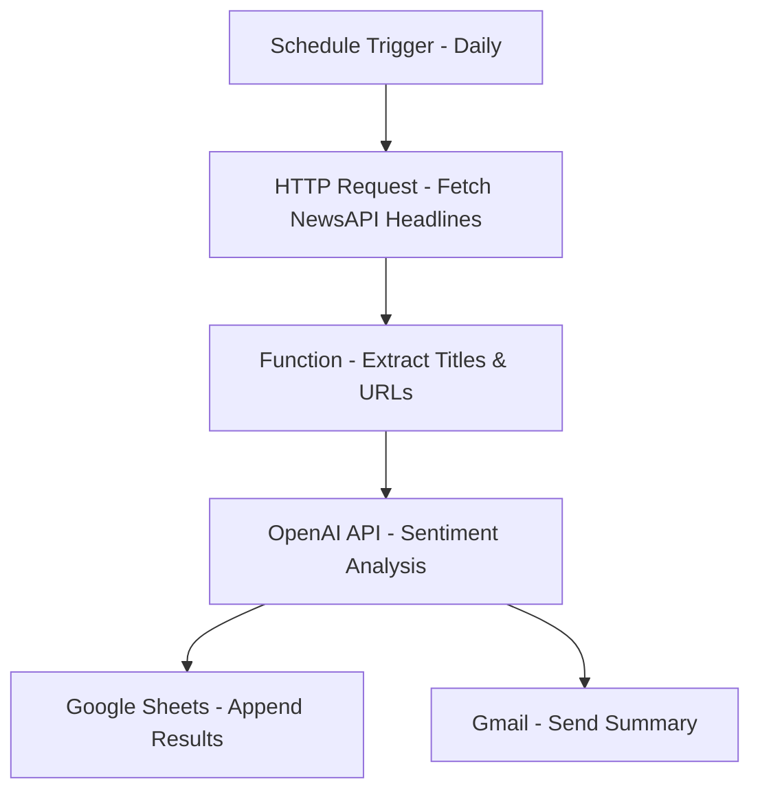

# 1. AI-Powered Automated QA Workflow in n8n

## Project Overview
This project automates the analysis, reporting, and tracking of automated test results using n8n, OpenAI, PostgreSQL, Jira, and Slack. 
It takes test results from your automation framework, analyzes failed tests with AI, stores them in a database, creates Jira bug tickets, and sends Slack notifications for passed tests.

## High-Level Workflow

### Step 1 – Input the test results
- Begin with JSON test results from your automation framework.
- Each test includes name, status (passed/failed), and messages.

### Step 2 – Split the results
- Split combined array into individual test items for independent processing.

### Step 3 – Add a decision (IF) node
- Route test cases based on status:
  - Failed → AI analysis, database insertion, Jira ticket creation
  - Passed → Slack notification

### Step 4 – Process failed test cases
1. **AI Analysis (OpenAI Node)**: Generate reason, suggestion, and severity for each failed test.
2. **Split AI Results**: Separate array into individual n8n items.
3. **Store in PostgreSQL**: Insert failed test records into a database table.
4. **Create Jira Tickets**: Automatically create bug tickets with test details.
5. **Notifications**: Send email or Slack alerts summarizing failed tests.

### Step 5 – Process passed test cases
- Send Slack notification for successfully passed tests with summary messages.

### Step 6 – Database Configuration
- PostgreSQL table 'failed_tests' with columns: id, test_name, reason, suggestion, severity, created_at.
- n8n connects using host, user, password, port, and database name.

### Step 7 – Jira API Setup
- Authenticate with email and API token.
- Choose project and issue type, map test details to ticket fields.

### Step 8 – Slack Notification Setup
- Use Slack webhook URL.
- Send messages for passed and failed tests.

  src="https://github.com/user-attachments/assets/527ff3d2-bc76-4424-b30b-b3861de19c00" />

### Step 9 – Workflow Orchestration
- Nodes connected in order:
  1. Start / Webhook
  2. Split Results
  3. IF Node (Pass/Fail)
  4. Fail Branch: OpenAI → Split AI Results → PostgreSQL → Jira → Notify
  5. Pass Branch: Slack Notification

### Step 10 – Run and Automate
- Trigger manually or automatically after CI/CD test completion.
- Runs end-to-end without manual intervention.

## Outcome
- Failed tests are analyzed, logged, and converted into Jira tickets.
- Passed tests are acknowledged in Slack.
- AI provides insights for fixing failures.
- Improves QA visibility and developer feedback loops.

--------------------------------------------------------------

# 🧠 2 . AI News Sentiment Monitor

## Overview
An automated n8n workflow that fetches real-time English news, classifies each headline's sentiment using OpenAI GPT, stores results in Google Sheets, and emails a daily summary.

## Key Features
- Fetches live headlines from NewsAPI
- Runs sentiment analysis with GPT
- Appends structured results to Google Sheets
- Sends an email summary via Gmail
- Fully automated (daily or hourly trigger)

## Workflow Diagram

--------------------------------------------------------------------------------

