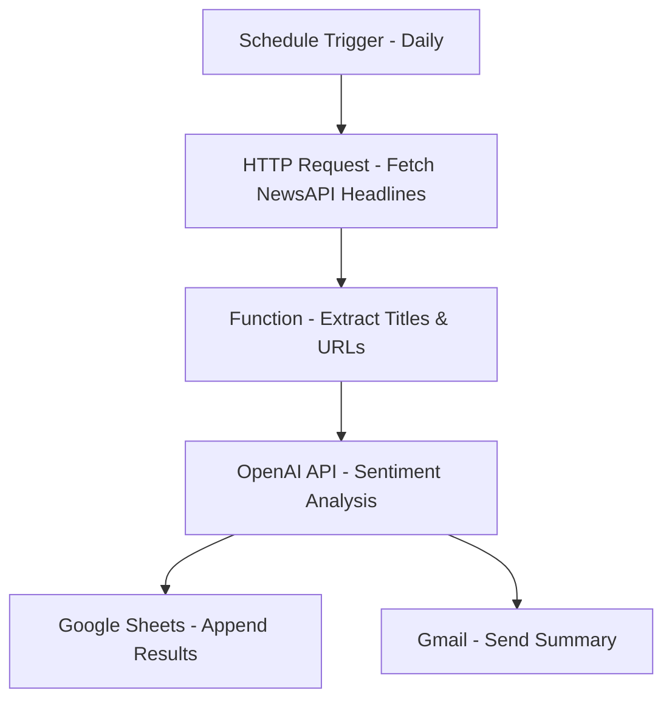

# 🧠 AI News Sentiment Monitor

## Overview
An automated n8n workflow that fetches real-time English news, classifies each headline's sentiment using OpenAI GPT, stores results in Google Sheets, and emails a daily summary.

## Key Features
- Fetches live headlines from NewsAPI
- Runs sentiment analysis with GPT
- Appends structured results to Google Sheets
- Sends an email summary via Gmail
- Fully automated (daily or hourly trigger)

## Workflow Diagram

